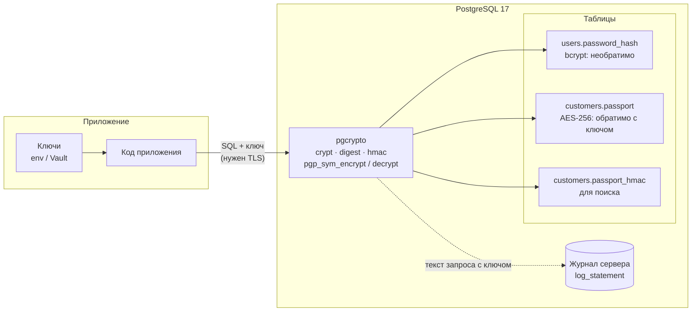

# Mermaid-диаграмма: где и чем защищены данные

```mermaid
flowchart LR
    subgraph APP["Приложение"]
        KEYS["Ключи<br/>env / Vault"]
        CODE["Код приложения"]
        KEYS --> CODE
    end

    subgraph PG["PostgreSQL 17"]
        EXT["pgcrypto<br/>crypt · digest · hmac<br/>pgp_sym_encrypt / decrypt"]
        subgraph TABLES["Таблицы"]
            U["users.password_hash<br/>bcrypt: необратимо"]
            C["customers.passport<br/>AES-256: обратимо с ключом"]
            H["customers.passport_hmac<br/>для поиска"]
        end
        LOG[("Журнал сервера<br/>log_statement")]
    end

    CODE -->|"SQL + ключ<br/>(нужен TLS)"| EXT
    EXT --> U
    EXT --> C
    EXT --> H
    EXT -.->|"текст запроса с ключом"| LOG
```
